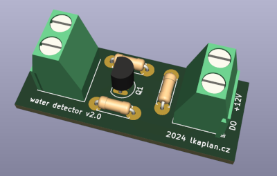
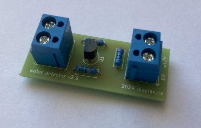
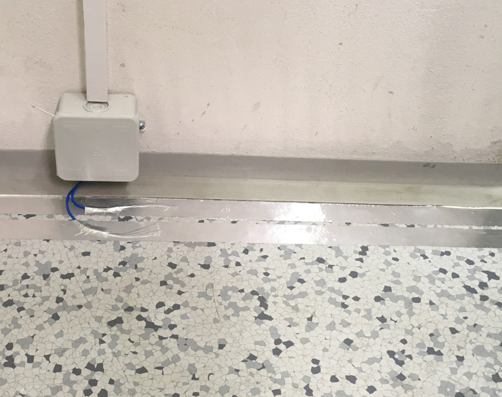
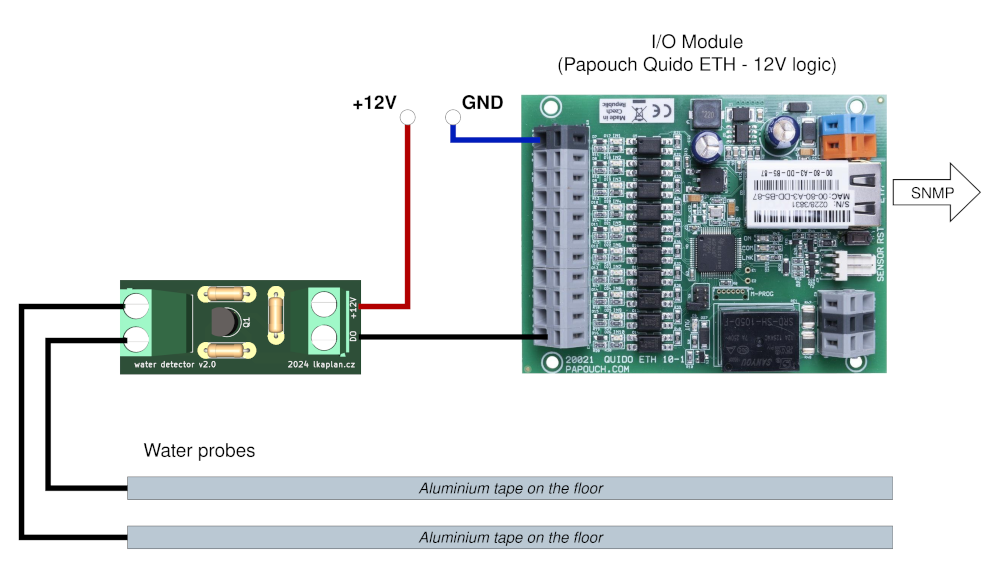
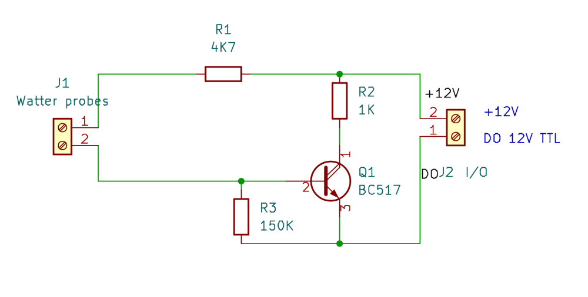

# simple_water_detector_12V

## Description

Simple water detector with 12V logic.

It is designed to be used with I/O modules [Papouch Quido ETH](https://papouch.com/io-moduly/quido/ethernet/) (12V inputs). 

## Usage example

Monitoring the server room environment for the presence of water on the floor. Water may occur in the server room, for example, due to condensation leakage from the air conditioning. Therefore, we can monitor areas at risk of water occurrence using this water detector.

Detection "probes" are attached to the floor and connected to the detector. Self-adhesive aluminum tape can be used as probes. (It can be purchased at an air ventilation store).

**Note that if an antistatic floor is used in the server room, it is necessary to isolate the aluminum tape from the floor.** It is best to do this by applying some non-conductive tape underneath. I do not recommend "Duck tape" because it is hydrophobic and prevents water from forming a puddle that would connect the electrodes. Ordinary transparent tape, commonly used for packages, has proven to be the most effective.

The output from the detector is connected to an I/O module. This module is then capable of sending an SNMP trap to Zabbix upon flood detection, thus alerting the monitoring team to the water leak problem.

## Installation

## Schematics

